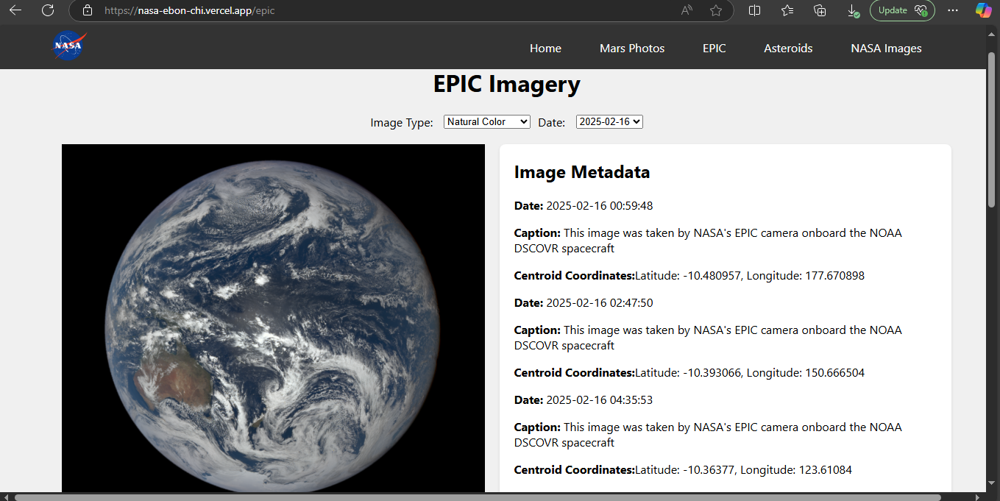

# NASA Image and Video Library Explorer

This project provides a simple web interface to explore the NASA Image and Video Library API.  Users can search for images and videos based on keywords and view details about specific assets.

## Live Demo

[nasa-ebon-chi.vercel.app](nasa-ebon-chi.vercel.app)

## Features

*   **Search:** Search the NASA Image and Video Library using keywords.
*   **Asset Details:** View detailed information (manifest, metadata, captions) for selected assets.
*   **Responsive Design:**  The website is designed to be responsive and work well on different screen sizes.

## Technologies Used

*   **Frontend:** React
*   **Backend:** Express.js
*   **Hosting:** Vercel
*   **API:** NASA Image and Video Library API

## Screenshots

**Astronomy Picture of the Day**


**Mars Photos**


**EPIC**


**Near Earth Asteroids (Graph)**


**NASA DAM**


## Setup (Local Development)

1.  **Clone the repository:**

    ```bash
    git clone [https://github.com/YOUR_GITHUB_USERNAME/YOUR_REPOSITORY_NAME.git](https://www.google.com/search?q=https://github.com/YOUR_GITHUB_USERNAME/YOUR_REPOSITORY_NAME.git)  # Replace with your repo URL
    cd YOUR_REPOSITORY_NAME
    ```

2.  **Install dependencies (frontend):**

    ```bash
    cd frontend
    npm install  # or yarn install
    ```

3.  **Install dependencies (backend):**

    ```bash
    cd backend
    npm install  # or yarn install
    ```

4.  **Run the development servers:**

    ```bash
    # In separate terminal windows:
    cd frontend
    npm start  # or yarn start

    cd backend
    npm run dev  # or yarn dev
    ```

    The frontend will typically run on port 3000, and the backend on port 5000 (or as configured).

## Deployment (Vercel)

1.  **Vercel Account:** Create a Vercel account (if you don't have one).

2.  **Vercel CLI:** Install the Vercel CLI:

    ```bash
    npm install -g vercel # or yarn global add vercel
    ```

3.  **Link to Vercel:** In your project directory (containing both `frontend` and `backend`), run:

    ```bash
    vercel
    ```

    Follow the prompts to log in and link your project.

4.  **Set Environment Variables:** In your Vercel project settings, add the `NASA_API_KEY` environment variable with your actual API key.

5.  **Deploy:** Vercel will automatically detect your project type and deploy your application.

## Project Structure